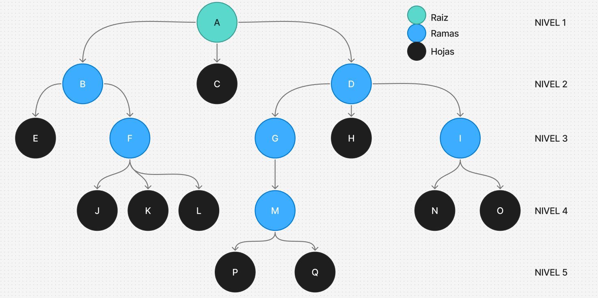
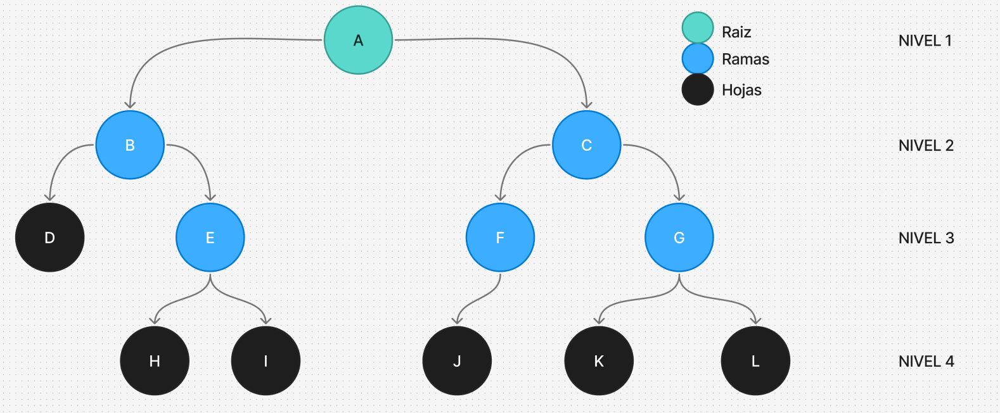
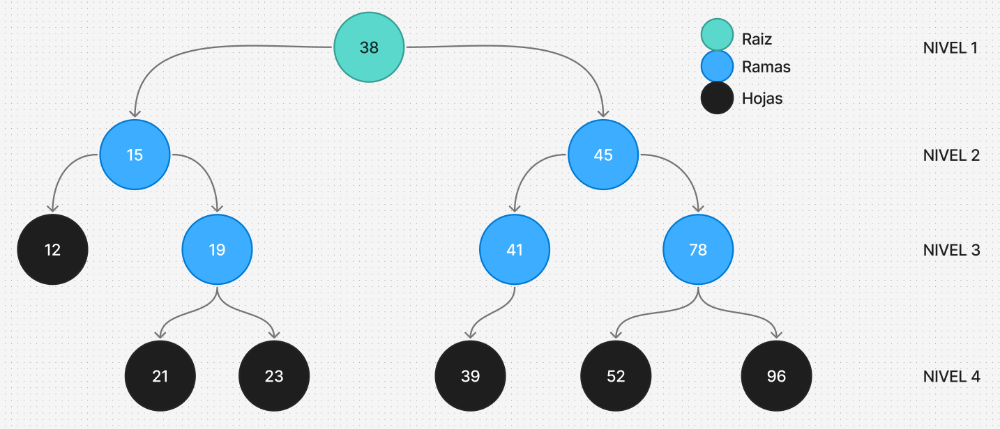

<div align="right">

</div>

# TDA ABB

## Alumno: Luca Frisoni - 113497 - lfrisoni@fi.uba.ar

- Para compilar:

```bash
make compilar
```

- Para ejecutar:

```bash
./programa
```

- Para ejecutar con valgrind:

```bash
make valgrind
```

---

## 🛠️Funcionamiento

### 🏛️Estructuras

Para este trabajo práctico se definieron distintas estructuras de datos que permiten organizar y manipular los elementos de forma eficiente.  
A continuación se detallan las estructuras principales:

---

#### 🔹`nodo_t`

Representa un **nodo** del arbol binario.

- Contiene un **puntero genérico** al dato almacenado _(Puede ser NULL)_.
- Guarda un **puntero** al siguiente nodo derecho _(Puede ser NULL)_.
- Guarda un **puntero** al siguiente nodo izquierdo _(Puede ser NULL)_.

📊 **Diagrama de memoria:**

---

#### 🔹`abb_t`

Representa un **arbol binario**.

- Contiene la **cantidad total** de elementos del arbol.
- Guarda un puntero al **nodo raiz**.
- Guarda una **funcion comparadora**.

📊 **Diagrama de memoria:**

---

### ⚙️Funcionamiento General

---

### 1. Validación de parámetros

Antes de iniciar cualquier procesamiento, el programa valida que los parámetros de entrada sean correctos con `validando_params(argc, argv)`:

- 🔹 Cantidad de argumentos: deben ser **exactamente 5** (`<ejecutable> <archivo.csv> buscar nombre|id <valor>`).
- 🔹 Formato del archivo: se comprueba que el archivo pasado como `argv[1]` tenga la extensión **.csv** con `validando_formato_csv()`.
- 🔹 Comando de operación: el argumento `argv[2]` debe ser **'buscar'**.
- 🔹 Tipo de búsqueda: el argumento `argv[3]` debe ser **"nombre"** o **"id"**.

---

### 2.Flujo de Ejecución

---

### 2.1 Lectura principal (según `argv[1]`)

Se realiza la lectura de un archivo **.csv** cuya ubicacion fue pasado por parametro con `tp1_leer_archivo()`.

```c
tp1_t *tp1_leer_archivo(const char *nombre);
```

**📌Esta funcion se encarga de:**

- 🔹 Manejar la apertura del archivo **.csv**📑 con `manejador_de_archivos_open()`
- 🔹 Crear la estructura **tp1_t**.
- 🔹 Leer y validar todas las lineas del archivo (se lee dinamicamente) con `leer_linea()`.
- 🔹 Transforma la linea de texto en un tipo pokemon **struct pokemon** si es valido con `parsear_pokemon()` y demas funciones internas.
- 🔹 Agregar el pokemon parseado a la estructrua **tp1_t** con `agregar_pokemon()`.
- 🔹 Ordenar ascendemente los pokemones por id una vez finalizada la lectura completa del archivo con `bubbleSort_pokemones_id_asc_optimizado()`.
- 🔹 Correcta liberacion de memoria y cierre de archivos.
- 🔹 Retorno de la estructura con los pokemones y su cantidad.

- ⚠️ En caso de que el archivo no respete el formato, no se pueda abrir o falle la reserva de memoria, la función devuelve `NULL`.

---

### 2.2 Inserscion en abb

Se recorre la estructura `tp1_t` que contiene los pokemones previamente cargados desde un archivo .csv con `tp1_leer_archivo()`, y se aplica una función callback a cada Pokémon, en este caso , para insertarlo en el **arbol binario de busqueda**.

```c
size_t tp1_con_cada_pokemon(tp1_t *un_tp, bool (*f)(struct pokemon *, void *),
			    void *extra);
```

**📌Esta función se encarga de:**

- 🔹Recorrer todos los pokemones almacenados en la estructura tp1_t.
- 🔹Por cada pokémon, llamar a la función f que recibe como parámetros:

1. Un puntero al struct pokemon actual.
2. El puntero extra, que en este caso es el abb creado con `abb_crear()` donde se van a insertar los pokemones.

- 🔹Inserta cada pokemon con `abb_insertar()` hasta que no haya mas pokemones.
- 🔹Retorna la cantidad de pokemones para los cuales f devolvió true.

_Ejemplo de uso:_

```c
abb_t *abb = abb_crear(comparador_id_pk);
tp1_con_cada_pokemon(tp1, guardar_en_abb, abb);
```

---

### 2.3 Selección de operación (según `argv[2]`)

El sistema permite al usuario hacer una busqueda entre 2 operaciones predefinidas.

#### 🔍 buscar

**Parámetros:** `<tipo_busqueda> <valor>`

- 🔹Permite buscar un Pokémon en el archivo:
  - `nombre`: busca con el iterador interno `abb_con_cada_elemento()`.
  - `id`: busca con `abb_buscar()` ya que el arbol esta ordenado por ID.
- 🔹Si lo encuentra, se muestra con `mostrar_pokemon()`.
- 🔹Si no existe, devuelve **NULL** e imprime que no fue encontrado

### 3. Liberación de Memoria

Al finalizar la ejecución:

- 🗑️Se destruye el abb de Pokémones con `abb_destruir(abb)`.

- 🗑️Se libera la estructura principal del TP y los pokemones con `tp1_destruir(tp1)`.

Esto asegura que no queden memory leaks ni recursos sin liberar.

---

## Tests Unitarios

Esta sección describe cómo se verifican todas las funciones primitivas del proyecto mediante pruebas unitarias y de estrés.

### Objetivo

- 🔹Comprobar que cada función del proyecto se ejecute correctamente en distintos escenarios.
- 🔹Asegurar que las operaciones sobre las estructuras dinámicas se realicen sin errores de memoria.
- 🔹Validar el correcto funcionamiento de cada una de las Estructura de Datos.
- 🔹Confirmar que las funciones devuelvan los resultados esperados.
- 🔹Asegurarse el buen funcionamiento en casos demandantes

### Cobertura de pruebas

Se realizan **187 pruebas unitarias** que incluyen:

- 🔹**Pruebas de creacion**
- 🔹**Pruebas de incercion**
- 🔹**Pruebas de eliminacion**
- 🔹**Pruebas de busqueda**
- 🔹**Pruebas de existencia**
- 🔹**Pruebas de liberacion de memoria**
- 🔹**Pruebas de iteracion**
- 🔹**Pruebas de combinacion de funciones**
- 🔹**Pruebas de estres**

### Compilación y ejecución de tests

Para compilar los tests:

```bash
make compilar_t
```

Para ejecutar los tests:

```bash
./tests
```

Para ejecutar con valgrind:

```bash
make valgrind_t

```

---

## 📚Respuestas a las preguntas teóricas

### 1. Explique teóricamente (y utilizando gráficos) qué es una árbol, árbol binario y árbol binario de búsqueda. Explique cómo funcionan y de ejemplos de utilización de cada uno.

#### Árbol

Un árbol es una estructura de datos jerárquica formada por nodos conectados mediante aristas.

- Cada nodo puede tener cero o más hijos.

- Existe un nodo raíz, que es el nodo superior del árbol.

- Los nodos que no tienen hijos se llaman hojas.

- Cada nodo tiene un padre, excepto la raíz, que no tiene.

- Cada nodo es un subarbol hacia abajo

##### Cómo funciona:

- Permite organizar información de manera jerárquica.

- Se puede recorrer de varias formas: profundidad primero (preorden, postorden, inorden) o amplitud primero (nivel por nivel).

##### Ejemplos de uso:

- Estructura de directorios en un sistema operativo.

- Árbol de decisión en inteligencia artificial.

- Representación de jerarquías familiares.

##### Tipos de Árbol(Ademas de los que pide la consigna)

- **N-arios:** Cada nodo puede tener hasta n hijos.

###### Ejemplo: árbol de directorios en un sistema operativo.

- **AVL:** ABB auto-balanceado, donde la diferencia de altura entre subárboles izquierdo y derecho de cada nodo es como máximo 1.

###### Ejemplo: búsqueda eficiente garantizada.

**Árbol Rojo-Negro:** ABB balanceado con reglas de color para mantener altura logarítmica.

###### Ejemplo: implementaciones de std::map en C++ o TreeMap en Java.

**Árboles B, B- y B+:** Árboles balanceados con múltiples hijos por nodo, usados en bases de datos y sistemas de archivos.

###### Ejemplo: índices en bases de datos.

**Heap Binario:** Árbol binario completo donde cada nodo cumple propiedad de heap (padre ≥ hijos para max-heap, padre ≤ hijos para min-heap).

###### Ejemplo: colas de prioridad.

##### Operaciones basicas

1. **Crear:** Inicializa la estructura del árbol.

2. **Destruir:** Libera todos los nodos y la memoria asociada.

3. **Insertar:** Agrega un nodo respetando las propiedades del árbol.

4. **Borrar:** Elimina un nodo y ajusta el árbol según su tipo.

5. **Buscar:** Encuentra un nodo o valor en el árbol.

6. **Vacío:** Verifica si el árbol tiene nodos o está vacío.

7. **Recorrer**: Visita todos los nodos siguiendo un orden específico:

- **Inorden:** Izquierda → Nodo → Derecha.

- **Preorden:** Nodo → Izquierda → Derecha.

- **Postorden:** Izquierda → Derecha → Nodo.

📊 **Diagrama**  


#### Árbol Binario

Un árbol binario es un árbol donde cada nodo puede tener como máximo dos hijos: un hijo izquierdo y un hijo derecho.

##### Cómo funciona:

- Cada nodo apunta a hasta dos subárboles (izquierdo y derecho).

- Se pueden realizar recorridos similares a los del árbol general: inorden, preorden, postorden.

##### Ejemplos de uso:

- Representación de expresiones matemáticas (árboles de expresión).

- Árboles de decisión donde cada decisión es binaria (sí/no).

- Juegos tipo “adivina el número” o “árbol de preguntas”.

  📊 **Diagrama**  
  

#### Árbol Binario de Búsqueda

Un árbol binario de búsqueda es un árbol binario con una propiedad especial de orden:

Para cada nodo:

- Los valores en el subárbol izquierdo son menores que el valor del nodo.

- Los valores en el subárbol derecho son mayores que el valor del nodo.

##### Cómo funciona:

- Esto permite buscar, insertar o eliminar elementos de forma eficiente.

- La búsqueda se hace comparando el valor buscado con el nodo actual y descendiendo a izquierda o derecha según corresponda.

- La complejidad depende de la altura del árbol:

1. Árbol balanceado → O(log n)

2. Árbol desbalanceado → O(n)

##### Ejemplos de uso:

- Bases de datos donde se requiere búsqueda rápida.

- Diccionarios y tablas de símbolos.

- Implementación de conjuntos ordenados o mapas ordenados.

  📊 **Diagrama**  
  

### 2. Explique la implementación de ABB realizada y las decisiones de diseño tomadas (por ejemplo, si tal o cuál funciones fue planteada de forma recursiva, iterativa o mixta y por qué, que dificultades encontró al manejar los nodos y punteros, reservar y liberar memoria, etc).

1. **Recursividad vs Iteración**

Las operaciones principales (insertar, buscar, eliminar) fueron implementadas recursivamente.

- Los recorridos (inorden, preorden, postorden) se implementaron de manera recursiva para visitar nodos en el orden deseado y permitir aplicar una función sobre cada dato.
- Justificación: facilita la lógica de manejo de subárboles y reduce la complejidad del código, ya que cada llamada recursiva maneja un subárbol completo.

2. **Manejo de nodos y punteros**

- Cada nodo se reserva dinámicamente con calloc al insertar un nuevo elemento.

- Los punteros a los hijos se actualizan cuidadosamente para mantener la estructura del árbol.

- Al eliminar nodos, se libera la memoria usando free, y se actualizan los punteros de los padres para evitar pérdidas de memoria o punteros colgantes.

3. **Funciones auxiliares**

Se crearon funciones como `reemplazar_por_predecesor` y `reemplazar_por_hijo` para manejar los casos de eliminación de nodos con dos hijos o un solo hijo, simplificando la lógica de `abb_eliminar`.

4. **Seguridad y robustez**

- Se verifican punteros nulos antes de acceder a nodos o a la raíz, evitando errores de segmentación.

- En funciones que reciben un puntero a ABB, se chequea que el árbol exista antes de realizar cualquier operación.

- Las funciones de destrucción permiten pasar un destructor de datos opcional para liberar memoria asociada a los datos almacenados en los nodos.

5. **Dificultades encontradas**

- Manejar correctamente los punteros a los hijos y la raíz, especialmente al eliminar nodos con dos hijos, para no perder referencias.

- La sintasix de los doble punteros

- Evitar errores de segmentación al recibir punteros nulos o datos inexistentes en las operaciones de búsqueda o eliminación.

- Reservar y liberar memoria sin generar fugas, asegurando que todos los nodos se liberen al destruir el árbol.

### 3. Explique la complejidad de las operaciones del .h implementadas para el TDA.

- **`abb_crear`** → O(1)
  La funcion ejecuta una cantidad constantes de pasos, independiemente del tamaño del árbol o de los datos
  Por lo tanto, la complejidad es O(1) en todos los casos.

- **`abb_insertar`** → O(log (n)) / O(n)
  La funcion hace llamados recursivos, que en cada paso hace operaciones de costo constante(comparaciones,asignaciones,reserva de memoria). La complejidad depende de la cantidad de pasos necesarios hasta encontrar la posicion correcta en el árbol. Por lo tanto si el arbol esta degenerado, en el peor de los casos,se comporta como una **lista** y es O(n). Si el arbol se encuentra **balanceado** es O(log(n)) en donde en cada paso se descarta aproximadamente la mitad de los nodos restantes(divide y venceras)

- **`abb_existe`** → O(log (n)) / O(n)
  La función hace llamados recursivos, que en cada paso realiza operaciones de costo constante (comparaciones, chequeos de punteros). La complejidad depende de la cantidad de pasos necesarios hasta encontrar el dato o llegar a un nodo nulo, lo cual está determinado por la altura del árbol.
  Por lo tanto, si el árbol está degenerado, en el peor de los casos se comporta como una **lista** y es O(n). Si el árbol se encuentra **balanceado**, la complejidad es O(log(n)), ya que en cada paso se descarta la mitad de los nodos restantes (divide y vencerás).

- **`abb_buscar`** → O(log (n)) / O(n)
  La función hace operaciones de costo constante al inicio (chequeo de punteros) y al final (retorno del dato o NULL). La complejidad depende de la llamada a `abb_buscar_nodo`, que en cada paso realiza comparaciones y chequeos de punteros de costo constante.
  Por lo tanto, si el árbol está degenerado, en el peor de los casos se comporta como una **lista** y es O(n). Si el árbol se encuentra **balanceado**, la complejidad es O(log(n)), ya que en cada paso se descarta la mitad de los nodos restantes (divide y vencerás).

- **`abb_eliminar`** → O(log (n)) / O(n)
  La función hace llamados recursivos, que en cada paso realizan operaciones de costo constante (comparaciones, chequeos de punteros, asignaciones y liberación de memoria). La complejidad depende de la cantidad de pasos necesarios hasta encontrar el nodo a eliminar, lo cual está determinado por la altura del árbol.
  En el peor de los casos, si el árbol está degenerado y se comporta como una **lista**, la altura es h = n, por lo que la complejidad es O(n). Si el árbol está **balanceado**, la complejidad es O(log(n)), ya que en cada paso se descarta aproximadamente la mitad de los nodos restantes (divide y vencerás).

- **`abb_raiz`** → O(1)
  La función realiza operaciones de costo constante: chequeo de punteros y retorno del dato de la raíz. No depende del tamaño del árbol ni recorre nodos.
  Por lo tanto, la complejidad es O(1) en todos los casos.

- **`abb_cantidad`** → O(1)
  La función realiza operaciones de costo constante: chequeo de puntero y retorno de un valor almacenado en la estructura. No depende del tamaño del árbol ni recorre nodos.
  Por lo tanto, la complejidad es O(1) en todos los casos.

- **`abb_esta_vacio`** → O(1)
  La función realiza operaciones de costo constante: chequeo de puntero y comparación con NULL. No depende del tamaño del árbol ni recorre nodos.
  Por lo tanto, la complejidad es O(1) en todos los casos.

- **`abb_con_cada_elemento`** → O(n)
  Las funcion hace llamados recursivos para recorrer los nodos del árbol, y en cada paso realizan operaciones de costo constante (comparaciones y llamadas a la función f). La complejidad depende de la cantidad de nodos que se visitan.
  Por lo tanto, en el peor caso, se recorren todos los nodos del árbol, lo que da una complejidad O(n), donde n es la cantidad de nodos del árbol.
  En consecuencia, la función `abb_con_cada_elemento` y los recorridos específicos **abb_in_orden**, **abb_pre_orden** y **abb_post_orden** tienen complejidad O(n) en el peor caso, visitando cada nodo exactamente una vez.

- **`abb_vectorizar`** → O(min(n, cant))
  La función realiza operaciones de costo constante al inicio (chequeos de punteros, inicialización de variables). Luego llama a `abb_con_cada_elemento`, que recorre los nodos del árbol y ejecuta operaciones de costo constante en cada nodo .
  La cantidad de nodos efectivamente procesados depende de la menor de dos cantidades: la cantidad de nodos del árbol **n** o el valor **cant** pasado como parámetro. Por lo tanto, la función recorre como máximo min(n, cant) nodos.
  En consecuencia, la complejidad de `abb_vectorizar` es O(min(n, cant)), ya que solo se procesan hasta cant nodos o todos los nodos existentes en el árbol.

- **`abb_destruir` y `abb_destruir_todo`** → O(n)
  La función hace llamados recursivos a `abb_destruir_nodo` para recorrer todos los nodos del árbol, y en cada paso realiza operaciones de costo constante: llamadas al destructor del dato (si existe) y liberación de memoria del nodo.
  Por lo tanto, en el peor caso, se recorren todos los nodos del árbol, lo que da una complejidad O(n), donde n es la cantidad de nodos del árbol.
  En consecuencia, las funciones `abb_destruir`, `abb_destruir_todo` tienen complejidad O(n), ya que visitan y liberan cada nodo exactamente una vez.
