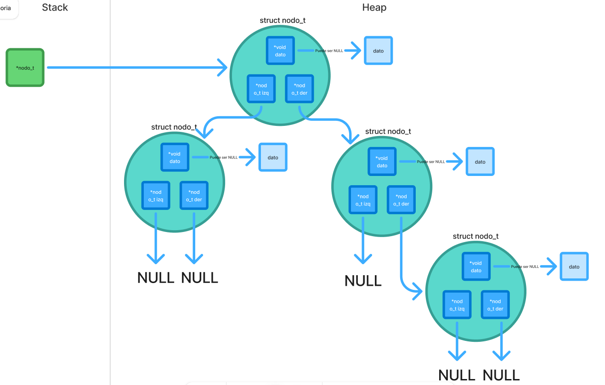

<div align="right">

</div>

# TDA ABB

## Alumno: Luca Frisoni - 113497 - lfrisoni@fi.uba.ar

- Para compilar:

```bash
make compilar
```

- Para ejecutar:

```bash
./programa
```

- Para ejecutar con valgrind:

```bash
make valgrind
```

---

## 🛠️Funcionamiento

### 🏛️Estructuras

Para este trabajo práctico se definieron distintas estructuras de datos que permiten organizar y manipular los elementos de forma eficiente.  
A continuación se detallan las estructuras principales:

---

#### 🔹`nodo_t`

Representa un **nodo** de la lista enlazada.

- Contiene un puntero genérico al dato almacenado.
- Guarda un puntero al siguiente nodo en la lista.

📊 **Diagrama de memoria:**  


---

---

### ⚙️Funcionamiento General

---

### 1. Validación de parámetros

Antes de iniciar cualquier procesamiento, el programa valida que los parámetros de entrada sean correctos con `validando_params(argc, argv)`:

- 🔹 Cantidad de argumentos: deben ser **exactamente 5** (`<ejecutable> <archivo.csv> buscar nombre|id <valor>`).
- 🔹 Formato del archivo: se comprueba que el archivo pasado como `argv[1]` tenga la extensión **.csv** con `validando_formato_csv()`.
- 🔹 Comando de operación: el argumento `argv[2]` debe ser **'buscar'**.
- 🔹 Tipo de búsqueda: el argumento `argv[3]` debe ser **"nombre"** o **"id"**.

---

### 2.Flujo de Ejecución

---

### 2.1 Lectura principal (según `argv[1]`)

Se realiza la lectura de un archivo **.csv** cuya ubicacion fue pasado por parametro con `tp1_leer_archivo()`.

```c
tp1_t *tp1_leer_archivo(const char *nombre);
```

**📌Esta funcion se encarga de:**

- 🔹 Manejar la apertura del archivo **.csv**📑 con `manejador_de_archivos_open()`
- 🔹 Crear la estructura **tp1_t**.
- 🔹 Leer y validar todas las lineas del archivo (se lee dinamicamente) con `leer_linea()`.
- 🔹 Transforma la linea de texto en un tipo pokemon **struct pokemon** si es valido con `parsear_pokemon()` y demas funciones internas.
- 🔹 Agregar el pokemon parseado a la estructrua **tp1_t** con `agregar_pokemon()`.
- 🔹 Ordenar ascendemente los pokemones por id una vez finalizada la lectura completa del archivo con `bubbleSort_pokemones_id_asc_optimizado()`.
- 🔹 Correcta liberacion de memoria y cierre de archivos.
- 🔹 Retorno de la estructura con los pokemones y su cantidad.

- ⚠️ En caso de que el archivo no respete el formato, no se pueda abrir o falle la reserva de memoria, la función devuelve `NULL`.

---

### 2.2 Selección de operación (según `argv[2]`)

El sistema permite al usuario hacer una busqueda entre 2 operaciones predefinidas.

#### 🔍 buscar

**Parámetros:** `<tipo_busqueda> <valor>`

- 🔹Permite buscar un Pokémon en el archivo:
  - `nombre`: busca por nombre con `tp1_buscar_nombre()`.
  - `id`: busca por ID con `tp1_buscar_id()`.
- 🔹Si lo encuentra, se muestra con `mostrar_pokemon()`.
- 🔹Si no existe, devuelve **NULL** e imprime que no fue encontrado

### 3. Liberación de Memoria

Al finalizar la ejecución:

- 🗑️Se destruye el abb de Pokémones con `abb_destruir(abb)`.

- 🗑️Se libera la estructura principal del TP con `tp1_destruir(tp1)`.

Esto asegura que no queden memory leaks ni recursos sin liberar.

---

## Tests Unitarios

Esta sección describe cómo se verifican todas las funciones primitivas del proyecto mediante pruebas unitarias y de estrés.

### Objetivo

- 🔹Comprobar que cada función del proyecto se ejecute correctamente en distintos escenarios.
- 🔹Asegurar que las operaciones sobre las estructuras dinámicas se realicen sin errores de memoria.
- 🔹Validar el correcto funcionamiento de cada una de las Estructura de Datos.
- 🔹Confirmar que las funciones devuelvan los resultados esperados.
- 🔹Asegurarse el buen funcionamiento en casos demandantes

### Cobertura de pruebas

Se realizan **171 pruebas unitarias** que incluyen:

- 🔹**Pruebas de creacion**
- 🔹**Pruebas de incercion**
- 🔹**Pruebas de eliminacion**
- 🔹**Pruebas de busqueda**
- 🔹**Pruebas de existencia**
- 🔹**Pruebas de liberacion de memoria**
- 🔹**Pruebas de iteracion**
- 🔹**Pruebas de combinacion de funciones**
- 🔹**Pruebas de estres**

### Compilación y ejecución de tests

Para compilar los tests:

```bash
make compilar_t
```

Para ejecutar los tests:

```bash
./tests
```

Para ejecutar con valgrind:

```bash
make valgrind_t

```

---

## 📚Respuestas a las preguntas teóricas

### 1. Explique teóricamente (y utilizando gráficos) qué es una árbol, árbol binario y árbol binario de búsqueda. Explique cómo funcionan y de ejemplos de utilización de cada uno.

### 2. Explique la implementación de ABB realizada y las decisiones de diseño tomadas (por ejemplo, si tal o cuál funciones fue planteada de forma recursiva, iterativa o mixta y por qué, que dificultades encontró al manejar los nodos y punteros, reservar y liberar memoria, etc).

### 3. Explique la complejidad de las operaciones del .h implementadas para el TDA.

- **`abb_crear`** → O(1)

- **`abb_insertar`** → O(1)

- **`abb_existe`** → O(1)

- **`abb_buscar`** → O(1)

- **`abb_eliminar`** → O(n), donde _n_ depende de la posición

- **`abb_raiz`** → O(n), donde _n_ depende de la posición

- **`abb_cantidad`** → O(n), donde _n_ depende de la posición

- **`abb_esta_vacio`** → O(n), donde _n_ depende de la posición

- **`abb_con_cada_elemento`** → O(n), donde _n_ es la cantidad de elementos.

- **`abb_vectorizar`** → O(n) , donde _n_ es la cantidad de elementos.

- **`abb_destruir`** → O(n), donde _n_ es la cantidad de elementos.

- **`abb_destruir_todo`** → O(1)
